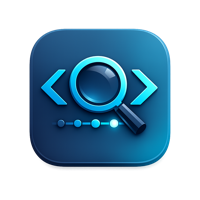

<p align="center">
  
</p>

<h1 align="center">codex-devtools</h1>

<p align="center">
  Desktop inspector for <a href="https://github.com/openai/codex">Codex</a> session data.
  <br />
  Browse conversations, search messages, and analyze agent activity across sessions.
</p>

<p align="center">
  <a href="https://www.npmjs.com/package/codex-devtools"></a>
  <a href="https://github.com/gulivan/codex-devtools/blob/main/LICENSE"></a>
</p>

---

## Quick start

> Requires **Node.js 20+** and **pnpm 10** (Corepack recommended).

```bash
git clone https://github.com/gulivan/codex-devtools.git
cd codex-devtools
corepack enable
pnpm install
pnpm approve-builds   # approve electron and esbuild
pnpm dev              # launch Electron app in dev mode
```

Or run instantly via npm without cloning:

```bash
npx codex-devtools
# or
bunx codex-devtools
```

This launches the native Electron app window.

To run web/HTTP mode explicitly:

```bash
npx codex-devtools --web
# or
bunx codex-devtools --web
```

Standalone mode serves at `http://localhost:3456`.

## Standalone mode

Run as an HTTP server without Electron:

```bash
pnpm standalone
```

Opens at `http://localhost:3456` by default.

## Production build

```bash
pnpm build            # compile renderer + main/preload
pnpm dist             # create installers for all platforms
```

Platform-specific:

| Command | Output |
|---------|--------|
| `pnpm dist:mac` | `.dmg`, `.zip` |
| `pnpm dist:win` | NSIS installer |
| `pnpm dist:linux` | AppImage, `.deb`, `.rpm` |

Build artifacts land in `release/`.

## Environment variables

| Variable | Default | Description |
|----------|---------|-------------|
| `CODEX_SESSIONS_PATH` | `~/.codex/sessions` | Path to Codex sessions directory |
| `HOST` | `0.0.0.0` | Standalone server host |
| `PORT` | `3456` | Standalone server port |

## Scripts

| Script | Description |
|--------|-------------|
| `pnpm dev` | Electron app in dev mode |
| `pnpm build` | Build renderer + Electron main/preload |
| `pnpm standalone` | Build and run standalone HTTP server |
| `pnpm dist` | Package for macOS + Windows + Linux |
| `pnpm dist:mac` | Package for macOS |
| `pnpm dist:win` | Package for Windows |
| `pnpm dist:linux` | Package for Linux |
| `pnpm test` | Run tests (Vitest) |
| `pnpm lint` | Run ESLint |
| `pnpm typecheck` | TypeScript type checks |

## CI/CD

| Workflow | Trigger | Action |
|----------|---------|--------|
| `ci.yml` | Push to `main`, PRs | Typecheck, lint, build, test |
| `release.yml` | Semver tags (`v*`), manual | Cross-platform packaging |
| `npm-publish.yml` | Semver tags (`v*`), manual | Publish to npm |

Required secret: `NPM_TOKEN` (npm automation token with publish + 2FA bypass).

## Releasing

```bash
npm version patch     # bumps version and creates git tag
git push origin main --follow-tags
```

Tags must be valid semver (`vMAJOR.MINOR.PATCH`). Pre-release metadata supported (`v1.2.3-beta.1`).

## Troubleshooting

**`Electron failed to install correctly`**

```bash
pnpm approve-builds   # approve electron and esbuild
pnpm install
pnpm dev
```

## License

[MIT](LICENSE)
