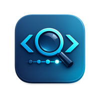

<p align="center">
  
</p>

<h1 align="center">codex-devtools</h1>

<p align="center">
  Desktop inspector for <a href="https://github.com/openai/codex">Codex</a> session data.
  <br />
  Browse conversations, search messages, and analyze agent activity across sessions.
</p>

<p align="center">
  <a href="https://www.npmjs.com/package/codex-devtools"></a>
  <a href="https://github.com/gulivan/codex-devtools/blob/main/LICENSE"></a>
</p>

---

## Quick start

Requires:
- **Bun 1.2+**
- **Node.js 20+** (for tooling)
- **pnpm 10**

```bash
git clone https://github.com/gulivan/codex-devtools.git
cd codex-devtools
corepack enable
pnpm install
pnpm dev
```

This launches the Electrobun desktop app.

Run from npm/bunx:

```bash
bunx codex-devtools
# or
npx codex-devtools
```

## Standalone mode

Run as an HTTP server without desktop shell:

```bash
pnpm standalone
```

Or from the CLI entry:

```bash
codex-devtools --web
```

Default standalone host: `http://localhost:3456`.

## Build

```bash
pnpm build          # vite renderer + electrobun desktop build
pnpm dist           # stable electrobun package for current host platform
```

Notes:
- Electrobun builds are host-platform only.
- `dist:mac`, `dist:win`, and `dist:linux` are host aliases to `pnpm dist`.

## Environment variables

| Variable | Default | Description |
|----------|---------|-------------|
| `CODEX_SESSIONS_PATH` | `~/.codex/sessions` | Path to Codex sessions directory |
| `HOST` | `0.0.0.0` | Standalone server host |
| `PORT` | `3456` | Standalone server port |
| `CODEX_DEVTOOLS_DEFAULT_MODE` | `desktop` | Set to `web` to default CLI to standalone mode |

## Scripts

| Script | Description |
|--------|-------------|
| `pnpm dev` | Build renderer and run Electrobun dev mode |
| `pnpm dev:hmr` | Run Vite + Electrobun together |
| `pnpm build` | Build renderer + Electrobun desktop bundle |
| `pnpm standalone` | Build renderer and run standalone HTTP mode |
| `pnpm dist` | Stable Electrobun build (host platform) |
| `pnpm test` | Run tests (Vitest) |
| `pnpm lint` | Run ESLint |
| `pnpm typecheck` | TypeScript type checks |

## License

[MIT](LICENSE)
